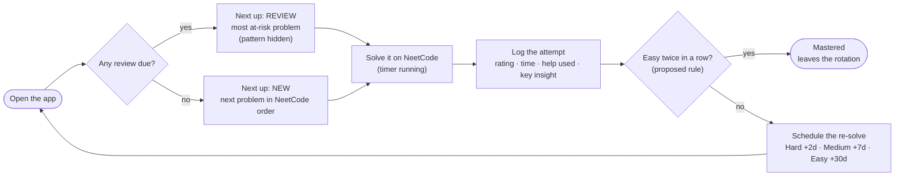

# MVP plan: spaced-repetition trainer for coding interviews

**Status:** draft for review · **Updated:** 2026-09-25 · **Evidence:** see [research.md](research.md)

## 1. One-liner

A web page that tells you **which coding problem to do next**: either a review you're about to forget or a new problem from the NeetCode 150. When you finish, you log how it went, and the page schedules the next re-solve based on how hard it felt: **Hard: 2 days · Medium: 7 days · Easy: 30 days**.

## 2. Goals and non-goals

**MVP goals**
- **G1.** A curated set of exercises: title, one-line description, type of problem (pattern) and NeetCode link.
- **G2.** Log an attempt in under 30 seconds: rating, time, help used and key insight.
- **G3.** Schedule the next re-solve with the 2/7/30 rule.
- **G4.** Always show **one clear "Next up"**: a due review or a new problem.
- **G5.** Show each problem's history (how your time and rating changed over attempts).

**Left out of the MVP on purpose**
- Accounts, login and sync across devices. The MVP stores data locally, with export/import.
- An in-app code editor or judge. You solve on NeetCode.
- AI hints, gamification (streaks, XP) and social features.
- Dashboards, notifications and a mobile app.
- Custom problem lists.
- Visual design polish. That comes later, in the Claude Design phase.

## 3. Who it's for

Developers preparing for coding interviews at top companies who:
- are working through the NeetCode 150, or about to start;
- keep forgetting problems they "already solved";
- want to be told what to do today instead of planning it themselves.

## 4. Core loop



## 5. Content: the exercise set

### 5.1 Which list

**NeetCode 150**, which already contains the Blind 75. It covers 18 topics: 28 Easy, 101 Medium, 21 Hard. The per-topic breakdown is in [research.md § C2](research.md#c2-curated-problem-lists).

### 5.2 Fields per exercise

| Field | Example | Notes |
|---|---|---|
| `id` | `contains-duplicate` | LeetCode slug, used as the stable key |
| `title` | Contains Duplicate | |
| `summary` | Return true if any value appears at least twice in the array. | **One line, in our own words** (see 5.3) |
| `pattern` | Arrays & Hashing | The NeetCode topic. This is the "type of problem" |
| `difficulty` | Easy | LeetCode's official difficulty, **not** the user's rating |
| `neetcodeUrl` | https://neetcode.io/problems/duplicate-integer | The practice page |
| `order` | 1 | Position in NeetCode's list, topic by topic (1–150) |
| `videoId` *(optional)* | `3OamzN90kPg` | NeetCode's explanation video, shown only after an attempt |
| `blind75` *(optional)* | true | Lets us add a Blind 75 filter later |

### 5.3 Where the data comes from, and the catches

- **Source:** `.problemSiteData.json` in the MIT-licensed [neetcode-gh/leetcode](https://github.com/neetcode-gh/leetcode) repo. It has title, pattern, difficulty, LeetCode slug, video ID and `neetcode150`/`blind75` flags. Filtering on `neetcode150 == true` gives exactly 150 problems, grouped topic by topic in the order NeetCode lists them. Keep the MIT notice.
- **Catch 1: NeetCode URLs.** NeetCode's practice pages use their **own slugs**, which differ from LeetCode's. Contains Duplicate is `/problems/duplicate-integer` and Valid Anagram is `/problems/is-anagram`. These slugs are *not* in the source file, so we map them by hand once and check each link. Don't use `neetcode.io/solutions/<leetcode-slug>` as the practice link, because it shows the answer. It works well as the "see solution" link instead.
- **Catch 2: descriptions.** Don't copy the LeetCode or NeetCode problem statements (they're copyrighted content). Write a one-line summary in our own words and link out to the full statement.
- **Catch 3: Premium problems.** 7 of the 150 are LeetCode Premium problems, such as Meeting Rooms and Alien Dictionary. Check that their NeetCode pages are free to use.
- **Process:** a one-off script generates `problems.json`. After that, the JSON file is the source of truth, edited by hand and checked into the repo.

```json
[
  {
    "id": "contains-duplicate",
    "title": "Contains Duplicate",
    "summary": "Return true if any value appears at least twice in the array.",
    "pattern": "Arrays & Hashing",
    "difficulty": "Easy",
    "neetcodeUrl": "https://neetcode.io/problems/duplicate-integer",
    "order": 1,
    "videoId": "3OamzN90kPg",
    "blind75": true
  },
  {
    "id": "valid-anagram",
    "title": "Valid Anagram",
    "summary": "Decide whether two strings contain exactly the same letters with the same counts.",
    "pattern": "Arrays & Hashing",
    "difficulty": "Easy",
    "neetcodeUrl": "https://neetcode.io/problems/is-anagram",
    "order": 2,
    "videoId": "9UtInBqnCgA",
    "blind75": true
  }
]
```

## 6. Logging an attempt (the "finish" form)

| Field | Required | Input | Why (research) |
|---|---|---|---|
| **Rating** | yes | Hard / Medium / Easy, with anchors (below) | Drives the schedule |
| **Time** | yes | Minutes, pre-filled by the timer, editable | Objective signal. You see progress across re-solves |
| **Help used** | yes (default: none) | None / Hint / Looked at the solution | Objective signal that counters illusions of competence ([A9](research.md#a9-metacognition-were-bad-judges-of-our-own-learning)) |
| **Key insight** | optional, encouraged | 1–2 sentences: "What's the trick? How would I recognize it next time?" | Self-explanation ([A7](research.md#a7-self-explanation)). Shown after your *next* attempt |
| **Notes** | optional | Free text: bugs, edge cases you missed | |
| *(automatic)* | | problem, date, timestamp, new vs review | |

**Rating anchors** (shown on the form, so ratings stay consistent over time):
- **Hard:** I needed the solution or a big hint, couldn't finish, or went way over the time box.
- **Medium:** I solved it on my own, but it was a struggle: slow to find the approach, several bugs, or over the time box.
- **Easy:** I saw the approach quickly and wrote a working solution within the time box.

Small nudge: if *Help used = Looked at the solution*, pre-select **Hard**. The user can still change it.

**Time box:** 15 / 30 / 45 min for LeetCode Easy / Medium / Hard. These are our own starting defaults, editable in settings. The time box is guidance only: the timer shows elapsed time against it.

## 7. Scheduling rules

### 7.1 Your rule

| Rating | Next re-solve |
|---|---|
| Hard | +2 days |
| Medium | +7 days |
| Easy | +30 days |

- It applies after **every** attempt, whether first time or review.
- It counts **calendar days in the user's time zone**. Logged Medium on Oct 1 → due Oct 8, shown from the start of that day.

### 7.2 Proposed addition: Mastered (needs your OK)

**The problem:** with fixed intervals, nothing ever leaves the rotation, so the load never goes down. For 150 problems that's **at least 5 re-solves/day forever** (if every problem were rated Easy), and about 8–9/day in the [simulation](research.md#part-b-spaced-repetition-algorithms-and-where-2730-fits). Each re-solve takes 10–30 minutes.

**The rule:** if you rate a problem **Easy on its due review, and the previous rating was also Easy** (so it was still easy after the 30-day gap), it becomes **Mastered** and is no longer scheduled.
- You can still practice a mastered problem any time. If you then rate it Medium or Hard, it goes back into the normal rotation.
- In the simulation, reviews drop to about 1/day by week 24, instead of staying at about 8–9/day forever.
- A more conservative option if you prefer: Easy → 30 days → 60 days → mastered (more reviews, more certainty).

### 7.3 Edge cases (defined behavior)

| Situation | Behavior |
|---|---|
| A review is overdue | It stays due until done, with no penalty. The schedule restarts from the day you actually do it |
| You practice before the due date | Allowed. The schedule restarts from that day. It doesn't count toward Mastered |
| Several attempts on the same day | All are logged. The last one decides the schedule |
| An attempt was logged by mistake | Delete it. The state is recomputed from the remaining log |
| You gave up or looked at the solution | Log it anyway (Help = Solution, usually rated Hard, so it's back in 2 days) |
| A problem you solved before using the app | Log an attempt for it from the problem list |

### 7.4 State is derived from the attempt log

Problem state is **never stored**. It's computed from the attempts, and with about 150 × a few attempts that's trivial. As a result, undo is just deleting an attempt, and moving to FSRS later is just replaying the same log.

```ts
const INTERVAL_DAYS = { hard: 2, medium: 7, easy: 30 } as const;
type Rating = keyof typeof INTERVAL_DAYS;
type LocalDate = string; // "YYYY-MM-DD" in the user's time zone (string order = date order)

type ProblemState =
  | { status: "new" }
  | { status: "active"; lastRating: Rating; dueDate: LocalDate }
  | { status: "mastered"; since: LocalDate };

function deriveState(attempts: Attempt[]): ProblemState {
  let s: ProblemState = { status: "new" };
  for (const a of sortByCompletedAt(attempts)) {
    if (s.status === "mastered" && a.rating === "easy") continue; // still mastered
    if (
      s.status === "active" &&
      s.lastRating === "easy" && a.rating === "easy" &&
      a.date >= s.dueDate // an on-time or late review, not early practice
    ) {
      s = { status: "mastered", since: a.date };
      continue;
    }
    s = { status: "active", lastRating: a.rating, dueDate: addDays(a.date, INTERVAL_DAYS[a.rating]) };
  }
  return s;
}
```

## 8. The "Next up" recommendation

In order:
1. **A due review.** Among problems due today or earlier, pick the one **most at risk of being forgotten**: the highest `days overdue ÷ interval`. On a tie, the last rating Hard goes first, then NeetCode's order.
2. **No review due:** the **next new problem in NeetCode's order**. Finish the current topic before starting the next one (blocked practice for new material, [A5](research.md#a5-blocks-for-learning-new-things-mixing-for-telling-them-apart)).
3. **Nothing due and nothing new:** "All caught up" plus the date of the next review.

Plus: **Skip** shows the next candidate without changing any schedule. Skips last for this session only, and after the last candidate the list starts over. You can also start any problem from the list.

**Why reviews come first:** they're what you're about to forget. The rule also regulates itself: when the review pile grows, new problems wait instead of making the pile bigger.

**Pattern visibility:** new problems show the pattern (you're learning that topic). Reviews **hide it until the attempt is logged** ([A4](research.md#a4-interleaving-mixing-problem-types)), with a setting to always show it.

```ts
const SEVERITY: Record<Rating, number> = { hard: 2, medium: 1, easy: 0 };
type Active = Extract<ProblemState, { status: "active" }>;

function nextUp(problems: Problem[], state: Record<string, ProblemState>, today: LocalDate, skipped: Set<string>) {
  const open = problems.filter(p => !skipped.has(p.id));

  const due = open.filter(p => {
    const s = state[p.id];
    return s.status === "active" && s.dueDate <= today;
  });
  if (due.length > 0) {
    const s = (p: Problem) => state[p.id] as Active;
    const risk = (p: Problem) => daysBetween(s(p).dueDate, today) / INTERVAL_DAYS[s(p).lastRating];
    due.sort((a, b) =>
      risk(b) - risk(a) ||                                      // most at risk first
      SEVERITY[s(b).lastRating] - SEVERITY[s(a).lastRating] ||  // then Hard first
      a.order - b.order);                                       // then NeetCode's order
    return { kind: "review", problem: due[0] } as const;
  }

  const fresh = open.filter(p => state[p.id].status === "new").sort((a, b) => a.order - b.order);
  if (fresh.length > 0) return { kind: "new", problem: fresh[0] } as const;

  return { kind: "caught-up", nextDue: earliestDueDate(state) } as const;
}
```

## 9. Screens and flows (input for the Claude Design phase)

This section describes what each screen does, with no visual decisions.

| # | Screen | Must show | Main actions |
|---|---|---|---|
| S1 | **Today** | The Next up card: New/Review badge, title, one-line summary, pattern (new problems only), LeetCode difficulty. Counters: due today · new left · mastered. The list of other due reviews | Start · Skip · Browse all |
| S2 | **Solving** | Problem title, "Open on NeetCode" (new tab), running timer vs time box | I'm done · I looked at the solution · Cancel |
| S3 | **Log attempt** | Rating (3 options + anchors), time (pre-filled), help used, key insight, notes. After saving: the next due date, plus your previous time and insight for comparison | Save |
| S4 | **Problems** | All 150 grouped by topic, each with status (new / scheduled / due / mastered), last rating and next due date. Progress per topic | Open · Start |
| S5 | **Problem detail** | Summary, pattern, links (NeetCode; solution/video collapsed), attempt history (date, rating, time, help), insights | Start · Delete attempt |
| S6 | **Settings & data** | Time boxes, "show pattern on reviews", export/import JSON, reset progress | |

**States to design:** first run (empty), all caught up, big backlog (many overdue), everything mastered, import error.

**Constraints for the design:**
- It's used side by side with a NeetCode tab, so it needs to be compact.
- Logging must take under 30 seconds.
- Desktop-first for solving, but readable on a phone for checking what's due.
- On review screens, **never reveal the pattern or earlier insights before the attempt**.

## 10. Data model and storage

```ts
interface Problem {                 // static, from src/data/problems.json
  id: string; title: string; summary: string; pattern: string;
  difficulty: "Easy" | "Medium" | "Hard"; // LeetCode's
  neetcodeUrl: string; order: number; videoId?: string; blind75?: boolean;
}

interface Attempt {                 // append-only log = the source of truth
  id: string;                       // uuid
  problemId: string;
  startedAt?: string;               // ISO timestamp (from the timer)
  completedAt: string;              // ISO timestamp
  date: LocalDate;                  // local day of completion, used for scheduling
  rating: "hard" | "medium" | "easy";
  timeMinutes: number;
  help: "none" | "hint" | "solution";
  keyInsight?: string;
  notes?: string;
}

interface Settings {
  timeBoxMinutes: { Easy: number; Medium: number; Hard: number }; // 15 / 30 / 45
  showPatternOnReviews: boolean;                                   // false
}

interface SaveFile {                // what goes in storage and in the export file
  version: 1;
  attempts: Attempt[];
  settings: Settings;
  activeTimer?: { problemId: string; startedAt: string };
}
```

- **Storage:** browser `localStorage`, under one versioned key. Size check: 150 problems × ~6 attempts × ~300 bytes ≈ 270 KB, far below the ~5 MB limit.
- **Export/import JSON:** this is the backup and the way to move devices. It's essential when there's no backend.
- Keep persistence behind a tiny interface (`load()`, `save()`, `export()`, `import()`) so a backend can replace it later. `Attempt` maps 1:1 to a database table.

## 11. Tech stack and architecture (recommendation)

- **Vite + React + TypeScript**: a static single-page app with **no backend**.
- **Vitest**: unit tests for the scheduler and the recommender. They're the heart of the product.
- **Styling:** keep it minimal until the Claude Design pass. Tailwind is a good default for applying the design later.
- **Hosting:** any free static host (GitHub Pages, Vercel, Netlify, Cloudflare Pages).

```
src/
  data/problems.json      # the 150 exercises
  domain/dates.ts         # LocalDate helpers: today(), addDays(), daysBetween()
  domain/schedule.ts      # INTERVAL_DAYS, deriveState()   (pure, no React)
  domain/recommend.ts     # nextUp()                       (pure, no React)
  storage/localStore.ts   # load / save / export / import
  ui/                     # screens S1–S6
scripts/build-problems.ts # one-off: source JSON → problems.json
```

- **Rule:** `domain/` has no framework imports, so it's easy to test and easy to move to a server later.
- **Date pitfall:** do all scheduling on `LocalDate` strings, not `Date` objects in UTC. Otherwise you get off-by-one-day bugs around midnight and across time zones. Recompute "today" when the tab regains focus.
- **When to add a backend:** when you want accounts, multiple devices or real users' data. Supabase (Postgres + auth) or similar is enough.
- **Alternative considered:** Next.js + Supabase from day one. Pick it only if other people must use the MVP across devices right away. The cost is setting up auth, a database and privacy handling before the core loop is proven.

## 12. Build plan

Sizes are rough, for one developer: S ≈ half a day, M ≈ 1–2 days.

| Milestone | Scope | Size | Done when |
|---|---|---|---|
| **M0 Setup** | Vite/React/TS, lint, Vitest, CI | S | `npm test` passes in CI |
| **M1 Data** | `problems.json`: 150 entries, own summaries, NeetCode slugs mapped and links checked | M | Every link opens the right problem |
| **M2 Domain** | `dates`, `deriveState`, `nextUp` + tests | M | All acceptance tests (§13) pass |
| **M3 Storage** | localStorage + export/import | S | Data survives reload; export → import round-trips |
| **M4 UI** | Screens S1–S6, working but unstyled | M | The whole loop works end to end |
| **M5 Dogfood** | Use it daily for 2–3 weeks, write down friction | | Decide what changes |
| **M6 Design** | Claude Design pass → apply | | |

## 13. Acceptance criteria (these become the tests)

1. Hard logged on 2026-10-01 → due 2026-10-03. Medium → 2026-10-08. Easy → 2026-10-31.
2. A problem due today or earlier shows as **Review** in Next up before any new problem.
3. With no review due, Next up is the lowest-`order` problem never attempted.
4. Two due reviews: Hard due 2 days ago (risk 2/2 = 1.0) beats Medium due 3 days ago (3/7 ≈ 0.43).
5. Easy → Easy again 30+ days later (on the due review) → **Mastered**. Mastered problems never appear in Next up.
6. Easy → Easy only 10 days later (early practice) → **not** mastered, due 30 days after the second attempt.
7. Mastered → Medium → back in rotation, due in 7 days.
8. Deleting the latest attempt restores the previous state exactly.
9. Export → clear storage → import → identical state.
10. On a Review, the pattern isn't shown until the attempt is logged (unless the setting is on).

## 14. How we'll know it works

All of these can be computed from the export file, so no analytics are needed yet:
- **On-time reviews:** % of reviews done within 2 days of the due date (target ≥ 80%).
- **Re-solve speed:** median time on reviews vs first attempts of the same problems (should drop).
- **Rating progress:** share of problems moving Hard → Medium → Easy.
- **Load:** average re-solves per day stays within your daily time budget.
- **Habit:** days used per week.

## 15. Risks and mitigations

| Risk | Mitigation |
|---|---|
| The review pile grows and the user quits | Reviews first; the Mastered exit; later, a daily budget |
| Inconsistent self-ratings | Anchored ratings plus objective fields (time, help) |
| Data loss (browser storage cleared) | Export/import; later, a "last backup" reminder |
| Content/IP | Our own summaries, links out, keep the MIT notice for the metadata, no copied statements or logos |
| NeetCode URLs change | URLs live in one file (`problems.json`) |
| Crowded space (see [research § C5](research.md#c5-existing-tools-the-idea-is-validated-and-the-space-is-crowded)) | A guided "Next up", pattern-recognition training, honest signals, the Mastered exit |

## 16. Decisions needed from you

| # | Decision | My recommendation |
|---|---|---|
| 1 | Mastered rule (§7.2) | Easy twice in a row, with the second on the 30-day review → Mastered |
| 2 | Problem set | NeetCode 150 (add a Blind 75 filter later) |
| 3 | Accounts in the MVP | None: local-first + export/import |
| 4 | Hide the pattern on reviews | Yes, with a settings toggle |
| 5 | Time boxes | 15 / 30 / 45 min by difficulty, editable, guidance only |
| 6 | "Looked at the solution" | Log it as Hard (2 days), as your rule says. Check after dogfooding whether a next-day re-solve works better |

## 17. After the MVP (ideas, roughly by priority)

1. **Pattern guess** before a review ("Which pattern is this?"), checked against the category. It trains UMPIRE's *Match* step directly.
2. **Interview-date mode:** shrink intervals so reviews land before the interview ([A2](research.md#a2-spacing-distributed-practice)).
3. **Stats by pattern:** your weakest topics (Hard ratings, slow times).
4. **Related problems:** after solving, show the others with the same pattern, to compare similar problems ([A8](research.md#a8-expertise-means-seeing-the-deep-structure)).
5. **Accounts + sync, reminders.**
6. **FSRS scheduling**, by replaying the attempt log.
7. **Mock-interview mode:** a random due problem, pattern hidden, strict timer, and a talk-aloud/testing checklist.
8. **Finer technique tags:** monotonic stack, BFS on grid, top-k heap, prefix sums, union-find…
9. **More lists:** Blind 75, Grind 75, NeetCode 250.
